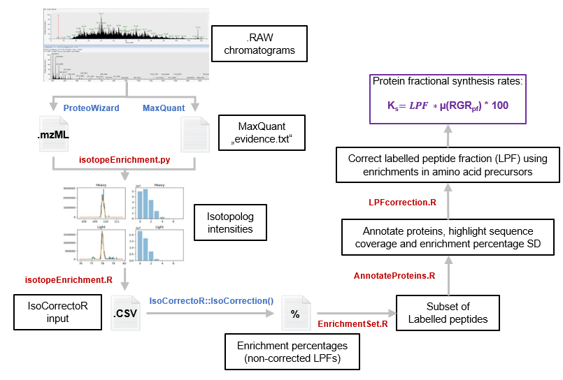

# isotopeEnrichment

The isotopeEnrichment.py script determines the abundances of infividual peptide isotopes in liquid chraomatography-mass spectrometry data. The resulting data can be used to determine the extent of heavy isotope incorporation into a target molecule in isotope tracer experiments.

**Workflow**

# Usage

isotopeEnrichment.py requires three different input files to run:

- MaxQuant 'proteinGroups.txt' file
- MaxQuant 'msmsScans.txt' file
- 'mzML' file produced from the raw instrument data file.

The isotopeEnrichment.py script uses the results files produced by MaxQuant to provide peptide and protein targeting information. As such, a MaxQuant search must first be conducted against an appropriate protein database file.

The isotopeEnrichment.py script depends on the following python libraries:

- pandas
- matplotlib
- scipy
- pymzml
- pyteomics

# How it works

isotopeEnrichment.py uses peptide assignment data from the msmsScans.txt file produced by MaxQuant to calculate the exact mass of theoretical isotopologues that could be expected if the peptide were to be enriched with an arbitrary number of 'heavy' labelled atoms. For each peptide, theoretical exact mases are then used to create an extracted ion chromatogram that is a summation of the intensities of each of the target isotopologues.

A gaussian curve is then fitted to this chromatogram and the target isotopologue intensities are taken as the average of the observed intensities in a given number of mass spectra either side of the gaussian peak maxima.

If a peptide is fully labelled (i.e. 100% isotope incorporation), the entire isotope distribution will be shifted to higher m/z which will likely impair assignment by MaxQuant. To account for this case, we only conduct maxquant searches on the 'control' samples that have not been treated with an isotopic label. The observed retention time and theoretical exact target mass data from peptides assigned by MaxQuant in the control sample are then used to identify the likely corresponding peptide in the isotope-treated samples. While the Gaussian fitting procedure provides some tolerance for drifts in retention time, chromatographic reproducibility in this analysis is of great importance.

In some cases, Gaussian curve fitting may be complicated by the presence of multiple peaks in the extracted window or by low abundance or absent peaks. To ensure that these do not lead to inaccurate or unexpected results, limits can be set on the tolerated range of peak full-width-half-maxima (FWHM). Peaks with FWHMs outside this range will be excluded.

# Examples

To conduct an analysis on all peptides from all proteins identified by MaxQuant in the MS_data_file.mzML data:

    python isotopeEnrichment.py --mzmlFile MS_data_file.mzML --proteinGroupsFile proteinGroups.txt --msmsScansFile msmsScans.txt

To conduct an analysis on only peptides from proteins containing '60S' in their name identified by MaxQuant in the MS_data_file.mzML data:

    python isotopeEnrichment.py --mzmlFile MS_data_file.mzML --proteinGroupsFile proteinGroups.txt --msmsScansFile msmsScans.txt --searchTerm 60S

To conduct an analysis on only peptides from proteins containing '60S', '40S' or '30S' in their name identified by MaxQuant in the MS_data_file.mzML data:

    python isotopeEnrichment.py --mzmlFile MS_data_file.mzML --proteinGroupsFile proteinGroups.txt --msmsScansFile msmsScans.txt --searchTerm 60S --searchTerm 40S --searchTerm 30S

A series of figures can be produced that show the EIC trace for the monoisotope peptide peak as well as the distribution of peptide isotopes determined. Drawing these figures takes additional time and so is disabled by default. Adding the --plot flag will activate plotting features:

    python isotopeEnrichment.py --mzmlFile MS_data_file.mzML --proteinGroupsFile proteinGroups.txt --msmsScansFile msmsScans.txt --searchTerm 60S --plot

# IsotopeEnrichment help
    usage: isotopeEnrichment.py [-h] [--searchTerm SEARCHTERM] --mzmlFile MZMLFILE
                                [--proteinGroupsFile PROTEINGROUPSFILE] --modificationSpecificPeptidesFile
                                MODIFICATIONSPECIFICPEPTIDESFILE [--minClusterWidth MINCLUSTERWIDTH]
                                [--addSpecialResidues] [--specialResidue SPECIALRESIDUE]
                                [--avgNSpectra AVGNSPECTRA] [--eicWidth EICWIDTH] [--eicLength EICLENGTH]
                                [--isotopeWeight ISOTOPEWEIGHT] [--processTopN PROCESSTOPN] [--plot]
                                [--plotTopN PLOTTOPN] [--outDirName OUTDIRNAME] [--profile]
                                [--fwhmLim FWHMLIM]

    Extract peptide isotope abundances from LCMS data

    optional arguments:
      -h, --help            show this help message and exit
      --searchTerm SEARCHTERM
                            Text search terms used to filter proteins that are to be indcluded in the
                            analysis. If omitted, all peptides will be included. To specify multiple
                            search terms, include multiple argument/value pairs. For exmaple --searchTerm
                            60S --searchTerm 40S --searchTerm 30S
      --mzmlFile MZMLFILE   File path of mzML data files. To specify multiple mzML files, include multiple
                            argument/value pairs. For example --mzmlFile sample1.mzML --mzmlFile
                            sample2.mzML --mzmlFile sample3.mzML
      --proteinGroupsFile PROTEINGROUPSFILE
                            File path of proteinGroups.txt file produced by MaxQuant
      --modificationSpecificPeptidesFile MODIFICATIONSPECIFICPEPTIDESFILE
                            File path of modificationSpecificPeptides.txt file produced by MaxQuant
      --minClusterWidth MINCLUSTERWIDTH
                            Number of isotopologues to consider in the analysis
      --addSpecialResidues  For each peptide, add the count of residues specified by the --specialResidue
                            flag to the target cluster width.
      --specialResidue SPECIALRESIDUE
                            Creates a column in the output tables containing the total number of
                            occurrences of the specified residue. To specify multiple residues, include
                            multiple argument/value pairs. For example "--specialResidue S
                            --specialResidue G" will create a column with the number of Gly and Ser
                            residues
      --avgNSpectra AVGNSPECTRA
                            Number of spectra either side of the EIC peak maximum to average when
                            calculating isotope abundances
      --eicWidth EICWIDTH   width (in m/z) used to produce EIC plots
      --eicLength EICLENGTH
                            Time range (in min) surrounding a target to produce EIC plots
      --isotopeWeight ISOTOPEWEIGHT
                            mass increment of isotope of interest
      --processTopN PROCESSTOPN
                            Process only the top N most abundant target peptides (measured by MS1
                            precursor intensity).
      --plot                Draw peptide EIC and isotope intensity graphics. This is very time consuming
                            if the number of target peptides is large.
      --plotTopN PLOTTOPN   Draw peptide EIC and isotope intensity graphics for only the top N most
                            abundant target peptides (measured by MS1 precursor intensity). Only active if
                            the --plot flag is given
      --outDirName OUTDIRNAME
                            Results directory name
      --profile             Calculate peak fitting statistics and produce summary plots
      --fwhmLim FWHMLIM     If specified, peptides with a FWHM greater than this value will be ignored.

# enrichment calculations

The isotopeEnrichment.R function arranges peptides into the required input files for natural isotopic abundance (NIA) correction and subsequent mean enrichment calculation. The caluclations are performed using the IsoCorrectoR R package:

*Heinrich, P., Kohler, C., Ellmann, L., Kuerner, P., Spang, R., Oefner, P. J., and Dettmer, K. (2018). Correcting for natural isotope abundance and tracer impurity in MS-, MS/MS- and high-resolution-multiple-tracer-data from stable isotope labeling experiments with IsoCorrectoR. Sci. Rep. 8.*

    ## preparing results files for correction

    IsEnr <- isotopeEnrichment(PyResultsDir = "result.dat", returnCSV = T, verbose = T)

    ## performing NIA correction and mean enrichment calculation

    library(IsoCorrectoR)

    Enrichment <- IsoCorrectoR::IsoCorrection(MeasurementFile = "MeasurementFile.csv",
                                              ElementFile = "ElementFile.csv",
                                              MoleculeFile = "MoleculeFile.csv",
                                              CorrectTracerImpurity = T,
                                              CorrectTracerElementCore = T,
                                              CalculateMeanEnrichment = T,
                                              UltraHighRes = F,
                                              FileOutFormat = "csv",
                                              ReturnResultsObject = T,
                                              CorrectAlsoMonoisotopic = T,
                                              verbose = T)
